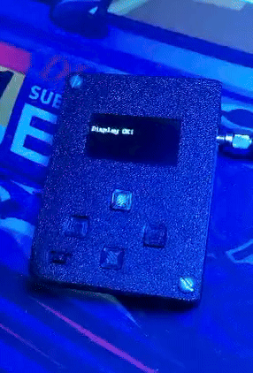
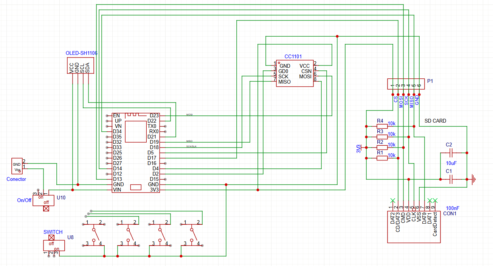

# Scary-RF

  
  

  <b>Low-cost • Open-Source • ESP32 + CC1101 • Sub-GHz RF Tool</b>

---

## 📡 Overview

The **Scary-RF Tool** is a low-cost, open-source Sub-GHz RF research device built using an **ESP32** and a **CC1101 transceiver**.

It is designed for:

- RF signal capture  
- Replay testing (Replay Attack)  
- Frequency analysis  
- RAW waveform visualization  
- Signal storage and playback  

This project focuses on **educational, experimental, and RF research purposes**.

---

## ⚠️ Disclaimer

This project is intended for **educational and research purposes only**.

The author is not responsible for misuse, illegal activities, or damage caused by this device.

Always comply with your local laws and regulations when working with radio frequency transmissions.

---

## 🛠 Hardware

### Core Components

- **ESP32** (multiple versions supported)
- **CC1101 Sub-GHz Transceiver**
- **1.3” OLED Display (SH1106 128x64)**
- **MicroSD Card Module**
- Push Buttons (navigation)
- Power Switch
- Frequency Selection Switch (315 / 433 MHz)
- Lithium Battery (recycled or new)
- Charging Regulator Board
- Custom etched copper PCB

---

## 🚀 Features

- 📡 Capture RF signals (315 / 433 MHz)
- 🔁 Replay captured signals
- 💾 Save and delete captures on SD card
- 📊 RAW waveform capture and visualization
- 🔍 Frequency identification (300–928 MHz)
- 🎲 Random code transmission (315–433 MHz)
- 📟 OLED real-time display
- 📢 BLE spam transmission

---

## 🔌 Hardware Pinout (ESP32)

| Component      | Pin | Function                        |
|---------------|------|--------------------------------|
| CC1101 RX     | 4    | RF Data Reception              |
| CC1101 TX     | 2    | RF Data Transmission           |
| SD CS         | 17   | Chip Select                    |
| SD MISO       | 34   | SPI MISO                       |
| SD MOSI       | 13   | SPI MOSI                       |
| SD SCK        | 14   | SPI Clock                      |
| BTN UP        | 27   | Navigate / Exit                |
| BTN DOWN      | 25   | Navigate / Save                |
| BTN LEFT      | 26   | Navigate / Library             |
| BTN RIGHT     | 32   | Navigate / Delete              |
| BTN OK        | 33   | Select / Transmit              |
| FREQ SWITCH   | 12   | 315 / 433 MHz Selector         |

---

## 💻 Installation

### Requirements

- Arduino IDE or PlatformIO
- ESP32 Board Package
- Required libraries:
  - ELECHOUSE_CC1101
  - Adafruit_SH1106 (or SH1106 compatible)
  - SD
  - SPI
  - Wire

### Flashing

1. Connect ESP32 via USB  
2. Select correct board  
3. Compile and upload firmware  
4. Insert SD card  
5. Power on device  

---

## 🗂 PCB Wires

  

---

## 🧠 Roadmap

- [x] RAW capture  
- [x] Deauther  
- [ ] BLE spam improvements  
- [ ] Rolljam cooperative mode (you and another Scary-RF)  
- [ ] Web-based file sharing (share captures)  
- [ ] ESP-NOW remote control (control Scary-RF from other devices)  
- [ ] Improved frequency analyzer  

---

## 🔬 Intended Use Cases

- RF security research  
- Remote control protocol analysis  
- Sub-GHz experimentation  
- Learning about radio communication  
- Embedded systems development  

---

## 📜 License

This project is open-source.

You are free to modify, improve, and distribute it under the chosen license.

---

## 🤝 Contributing

Pull requests are welcome.

If you find bugs or want to improve features, feel free to open an issue.

---

  Built with ESP32, curiosity, and a bit of chaos 👻

