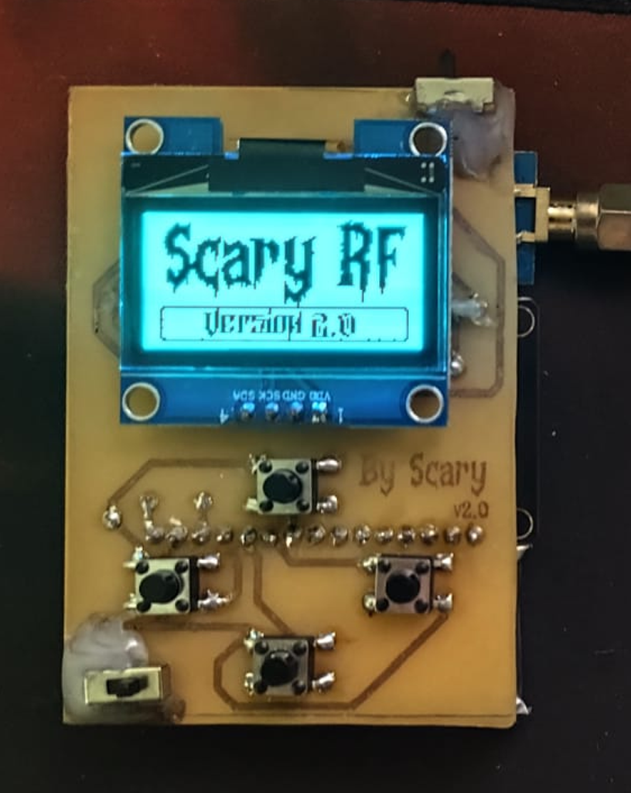
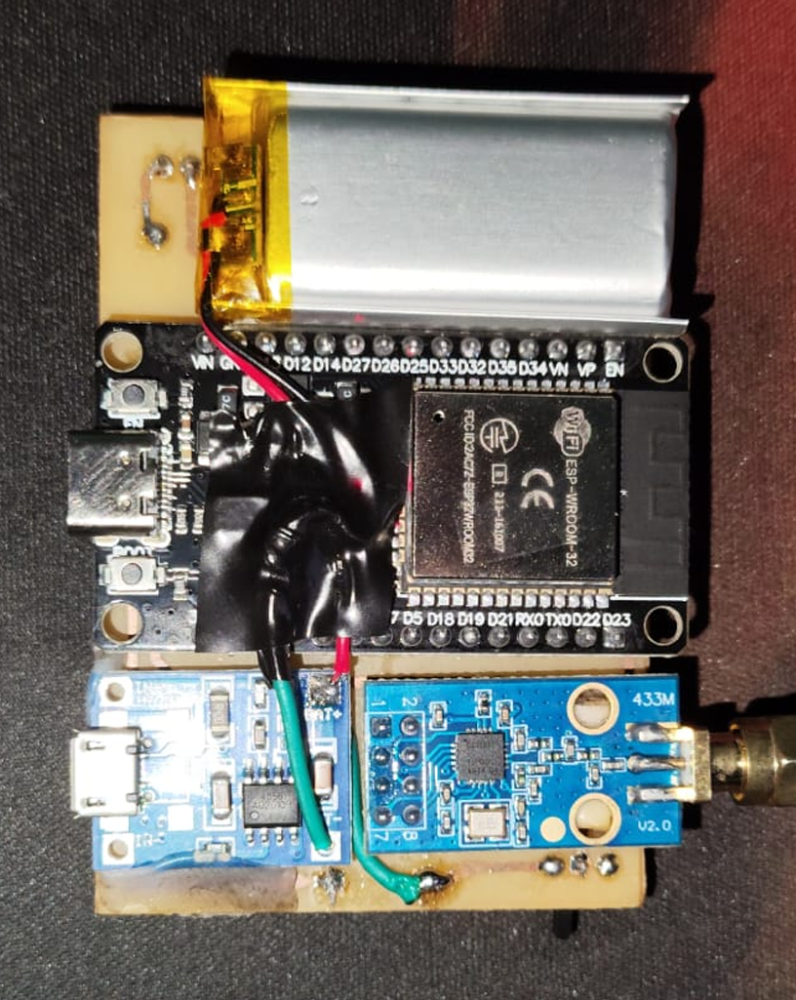

# Scary-RF Tool

## Descrição
O Scary-RF Tool é um projeto raiz de Arduino, usando um ESP32, um módulo CC1101 e alguns componentes para criar uma ferramenta versátil de comunicação por rádio (RF). Com ela, você pode capturar e reproduzir sinais RF (o famoso Replay Attack) nas frequências de 315MHz ou 433.92MHz, enviar um código aleatório em 315-433Mhz e analisar qual frequêcia esta recebendo 300-928Mhz. Ainda vou adicionar mais funções usando os 4 botões de navegação, criando um menu com mais possibilidades usando radiofrequência. (O plano é esse, projeto tá em pré-alpha, né!)

## Hardware Usado
- **ESP32:** O mais brabo.
- **Módulo CC1101:** O rei da comunicação RF. (ele e um transceiver então recebe e envia no mesmo módulo, sem contar que pega uma faixa grande de SubGhz).
- **Switches:** Um pra ligar e outro pra escolher a frequência.
- **Botões de Pressão:** Pro futuro menu.
- **Bateria:** 700mAh.
- **Placa Reguladora de Carga:** Aliexpress.
- **Placa de Cobre:** Feita na forma old school, usando estampagem e corroída no percloreto de ferro.
- **Tela OLED:** 128x64. (SH1106 1.3")

## Recursos Principais
- Pegar sinais RF com o módulo CC1101.
- Mostrar dados em um display OLED.
- Mandar de volta sinais RF na mesma frequência ou em outra.
- Futuras funções com os 4 botões.
- Identificar frequência do sinal (300-928Mhz).
- Enviar um código aleatório (315-433Mhz).
- Analizar e capturar o sinal em forma de Waveform

## Ligação de componentes

## Futuros recursos

To só estudando a possibilidade de fazer isso(ou fazer logo de uma vez):

- Captura de sinais RAW
- Atualização OTA
- Evil portal
- Deauther
- Bluetooth Spam
- Rolljam Coop (você e o amiguinho)
- Compartilhamento de arquivos via webservice (vou precisar colocar entrada de SD)
- Poder ser controlado por outros devices atraves do protocolo espNow

